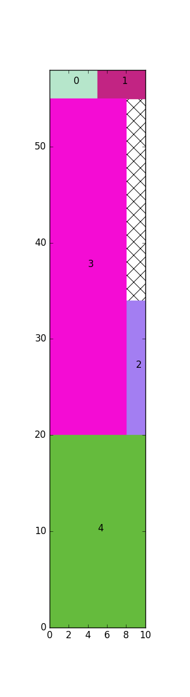

# About Strip-Packing
This repository contains implementations for the strip packing problem.

The strip packing problem optimizes the placing of rectangles in a strip of fixed width and variable length, such that the overall length of the strip is minimised.

Currently the 'Priority Heuristic' is implemented for the variant in which rotations are allowed and cuts have to follow the guillotine constrained.
This is implemented in the `phspprg` method.
More information about parameters and return values can be found in the docstrings in the source.

**note:** This algorithm is heuristic which means that the outcome is possibly not the most optimal.

This algorithms is based on the following paper: **A priority heuristic for the guillotine rectangular packing problem**
```
@article{zhang2016priority,
  title={A priority heuristic for the guillotine rectangular packing problem},
  author={Zhang, Defu and Shi, Leyuan and Leung, Stephen CH and Wu, Tao},
  journal={Information Processing Letters},
  volume={116},
  number={1},
  pages={15--21},
  year={2016},
  publisher={Elsevier}
}
```

The results can be visualized with the `visualize` method, **matplotlib** needs to be installed for this.


## Example
`example.py` demonstrates an example, including visualization:
```python
    boxes = [[5, 3], [5, 3], [2, 14], [35, 8], [10, 20]]
    width = 10
    height, rectangles = phspprg(width, boxes)
    visualize(width, height, rectangles)
    print("The height is: {}".format(height))

```

The output of the visualization is:


